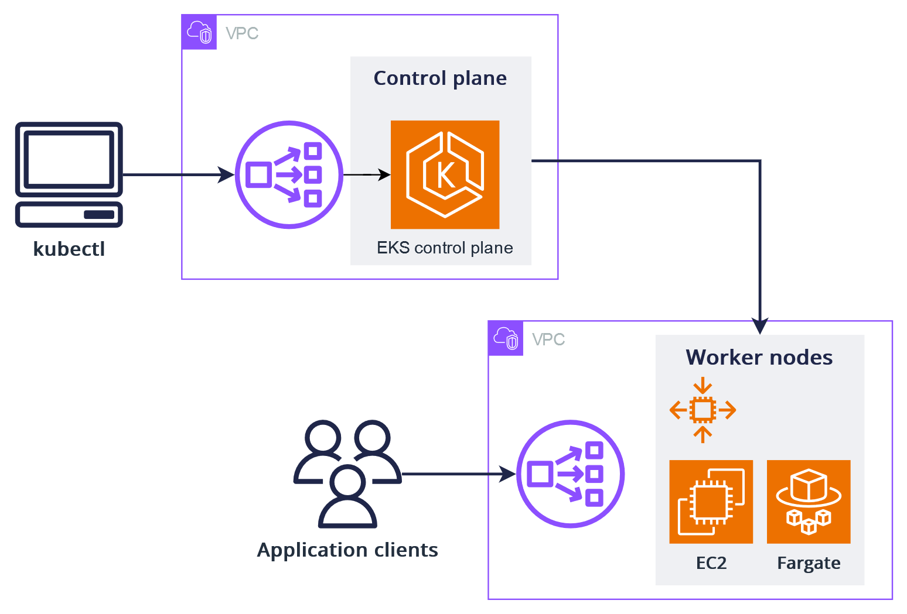

# EKS Cluster

## Manage Cluster eksctl



### To create cluster
```shell
eksctl create cluster --name=simple-cluster \
--region=eu-south-2 \
--nodes=1 --nodes-type t3.small
```

### Create cluster yaml file

```yaml
apiVersion: eksctl.io/v1alpha5
kind: ClusterConfig

metadata:
  name: simple-cluster2
  region: us-east-1

nodeGroups:
  - name: simple-cluster2-ng-1
    instanceType: t3.small
    desiredCapacity: 1
  - name: simple-cluster2-ng-2
    instanceType: t3.small
    desiredCapacity: 2
```
```sh
eksctl create cluster -f cluster.yaml
```

### To delete cluster

```shell
eksctl delete cluster --name=<cluster-name> --region=<region>

eksctl delete cluster --name=<cluster-name> --region=<region> --disable-nodegroup-eviction
```


### To list clusters
```sh
eksctl get cluster
```


### To display context info

```sh
kubectl config view 
kubectl config view --minify
```

### Get current context and modify context 

```sh
kubectl config current-context
kubectl config use-context italianodevops@simple-cluster.eu-south-2.eksctl.io
```

### To get nodegroup info
```sh
eksctl get nodegroup --cluster=<cluster-name>
```

## Manage Nodegroup

### Add nodegroup

```javascript
we can add a nogroup by modifiy the yaml file or through cli command
```
```yaml
nodeGroups: # Nodegroups magaged by our self
  - name: our-self-ng-2
    instanceType: t3.small
    desiredCapacity: 2
```
```sh
eksctl create nodegroup --config-file managed-nodegroups.yaml 
eksctl create nodegroup --cluster=<cluster-name> --name <ng-name> --node-type t3.small --nodes 1 --managed=false
```

### Delete nodegroup
```sh
eksctl delete nodegroup --cluster=<cluster-name> --name <ng-name> 
```


### Trouble shooting 

 
```sh
# List all stacks to identify the ones to delete
aws cloudformation list-stacks --region eu-south-2 --query 'StackSummaries[?contains(StackName, `italianodevops-cluster1`)]' > output.json
# We can check if we have some "DELETE_FAILED" resource

# Delete nodegroup stacks first
aws cloudformation delete-stack --region eu-south-2 --stack-name eksctl-italianodevops-cluster1-nodegroup-ng-1
aws cloudformation delete-stack --region eu-south-2 --stack-name eksctl-italianodevops-cluster1-nodegroup-ng-2

# Then delete the cluster stack
aws cloudformation delete-stack --region eu-south-2 --stack-name eksctl-italianodevops-cluster1-cluster


aws cloudformation continue-update-rollback --region eu-south-2 --stack-name eksctl-italianodevops-cluster1-cluster --resources-to-skip SubnetPublicEUSOUTH2B SubnetPublicEUSOUTH2C SubnetPublicEUSOUTH2A VPCGatewayAttachment

```