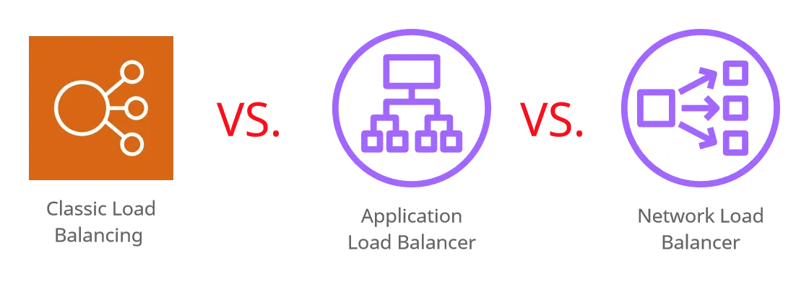
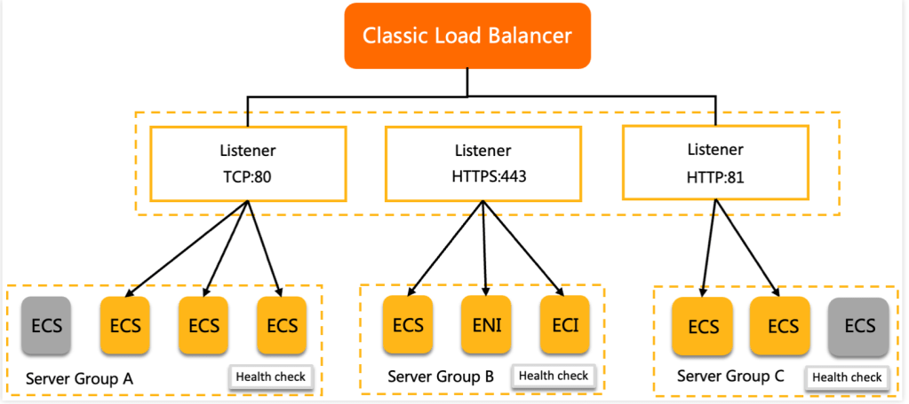
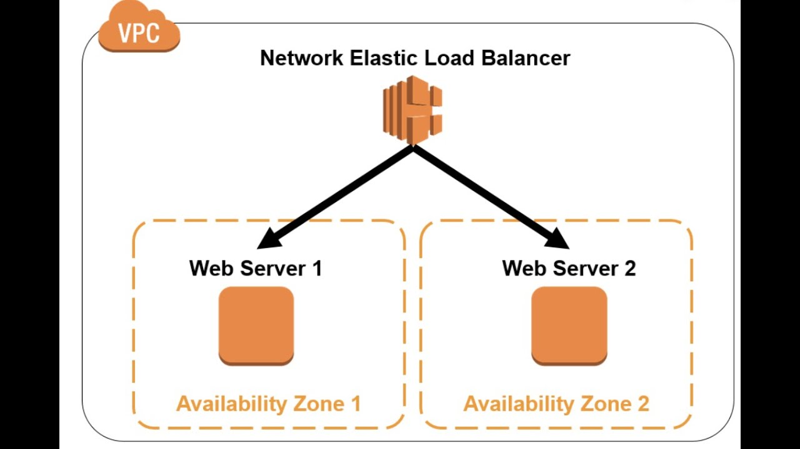
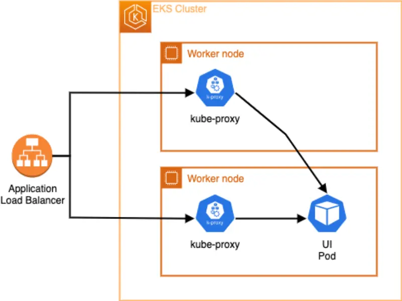

# Services

```sh
https://nidhiashtikar.medium.com/differences-alb-vs-nlb-vs-clb-29f25fc1033b
```


### Classic Load balancer




```yaml
apiVersion: v1 
kind: Service
metadata:
  name: clb-nginx-1
spec:
  type: LoadBalancer
  selector:
    app: simple-nginx-app
    env: prod
  ports:
    - protocol: TCP
      port: 80
      targetPort: 80
```

```sh
kubectl get services
#Output
NAME          TYPE           CLUSTER-IP     EXTERNAL-IP                                                               PORT(S)        AGE
clb-nginx-1   LoadBalancer   10.100.32.17   a948703811ece451191a86f7faea82cc-608767358.eu-south-2.elb.amazonaws.com   80:32116/TCP   3m21s

#Test
curl http://a948703811ece451191a86f7faea82cc-608767358.eu-south-2.elb.amazonaws.com  # Or through -> curl  public_ip:clb_port (if traffic allowed in SG)
```


### Network load balancer
```
This LB work with TCP/UDP traffic 4 layer
```


```sh
https://kubernetes-sigs.github.io/aws-load-balancer-controller/v2.2/guide/service/annotations/
```

```yaml
apiVersion: v1 
kind: Service
metadata:
  name: nlb-ngix-service
  annotations:
    service.beta.kubernetes.io/aws-load-balancer-type: nlb # Here we set the lb type
spec:
  type: LoadBalancer
  selector:
    app: simple-nginx-app
    env: prod
  ports:
    - protocol: TCP
      port: 80
      targetPort: 80

```

```sh
kubectl get services
NAME               TYPE           CLUSTER-IP       EXTERNAL-IP                                                                      PORT(S)        AGE
nlb-ngix-service   LoadBalancer   10.100.245.249   ab94e8ab4ae56439985d3029d86936a1-c05227d875b5e180.elb.eu-south-2.amazonaws.com   80:32112/TCP   6s

curl http://ab94e8ab4ae56439985d3029d86936a1-c05227d875b5e180.elb.eu-south-2.amazonaws.com
```


## Application Load Balancer




```
This LB work with http/https  7 layer OSI
```
```sh
# Connect OpenId provider with  iam to configure permissions properly
eksctl utils associate-iam-oidc-provider \
 --region <region> \
 --cluster <cluster-name> --approve 

# Get policy

wget https://github.com/kubernetes-sigs/aws-load-balancer-controller/raw/refs/heads/main/docs/install/iam_policy.json

# Create iam policiy 
aws iam create-policy --policy-name my_alb_controller --policy-document file://iam_alb_policy.json
```

```json
// Output
{
    "Policy": {
        "PolicyName": "my_alb_controller",
        "PolicyId": "ANPAUDAFJLBGRFHASWSOA",
        "Arn": "arn:aws:iam::xxxxxxx:policy/my_alb_controller",
        "Path": "/",
        "DefaultVersionId": "v1",
        "AttachmentCount": 0,
        "PermissionsBoundaryUsageCount": 0,
        "IsAttachable": true,
        "CreateDate": "2026-04-06T08:20:33+00:00",
        "UpdateDate": "2026-04-06T08:20:33+00:00"
    }
}
```

```sh
eksctl create iamserviceaccount \
  --region eu-south-2 \
  --namespace=kube-system \
  --cluster=italianodevops-cluster1 \
  --name=aws-alb-controller \
  --attach-policy-arn="arn:aws:iam::xxxxxxx:policy/my_alb_controller" \
  --override-existing-serviceaccounts \
  --approve

--attach-policy-arn=$(aws iam list-policies --query "Policies[?contains(PolicyName, 'alb')]" | awk '/arn/ {print $NF}' | cut -d "," -f 1)

helm repo add eks https://aws.github.io/eks-charts
helm repo update

helm install aws-load-balancer-controller eks/aws-load-balancer-controller  \
 --namespace=kube-system \
 --set clusterName=italianodevops-cluster1 \
 --set serviceAccount.create=false \
 --set serviceAccount.name=aws-alb-controller \
 --set region=eu-south-2 \
 --set vpcId=vpc-xxxxx
```
```javascript
NAME: aws-load-balancer-controller
LAST DEPLOYED: Mon Apr  6 10:37:02 2026
NAMESPACE: kube-system
STATUS: deployed
REVISION: 1
DESCRIPTION: Install complete
TEST SUITE: None
NOTES:
AWS Load Balancer controller installed!
```
```javascript
below we need
1) IngressClass  app_alb_1.yaml
2) A deployment (app to reach) nginx_deploy.yaml
3) Nodeport  app_alb_2.yaml
4) Ingress   app_alb_3.yaml
```
```yaml
# app_alb_1.yaml
# https://kubernetes.io/docs/concepts/services-networking/ingress-controllers/
apiVersion: networking.k8s.io/v1
kind: IngressClass
metadata:
  name: my-aws-ingress-class
  annotations:
    ingressclass.kubernetes.io/is-default-class: "true"

spec:
  controller: ingress.k8s.aws/alb
```

```yaml
apiVersion: v1 
kind: Service
metadata:
  name: deploy-nodeport
spec:
  type: NodePort
  selector:
    app: simple-nginx-app
    env: prod
  ports:
    - name: http
      port: 80
      targetPort: 80 
```

```yaml
apiVersion: networking.k8s.io/v1
kind: Ingress
metadata:
  name: ingress-app
  labels:
    app: app
  annotations:
    alb.ingress.kubernetes.io/load-balancer-name: appingress # ALB name
    alb.ingress.kubernetes.io/scheme: internet-facing # Internet exposed
    alb.ingress.kubernetes.io/healthcheck-protocol: HTTP 
    alb.ingress.kubernetes.io/healthcheck-port: traffic-port
    alb.ingress.kubernetes.io/healthcheck-path: /
    alb.ingress.kubernetes.io/healthcheck-timeout-seconds: '5'
    alb.ingress.kubernetes.io/success-code: '200'
    alb.ingress.kubernetes.io/healthy-threshold-count: '2'
    alb.ingress.kubernetes.io/healthcheck-interval-seconds: '20'
    alb.ingress.kubernetes.io/unhealthy-threshold-count: '5'
spec:
  ingressClassName: my-aws-ingress-class # defined into -> app_alb1.yaml
  defaultBackend:
    service: 
      name: deploy-nodeport # Defined into -> app_alb2.yaml nodeport name
      port:
        number: 80
```

```sh
kubectl describe ingress ingress-app 
kubectl describe ingress ingress-app | grep -i 'Address'

curl http://appingress-xxxxx.eu-south-2.elb.amazonaws.com
```


```
┌─────────────────────────────────────────────────────────────────────────────┐
│                                INTERNET                                     │
└─────────────────────────────────┬───────────────────────────────────────────┘
                                  │
                                  │ HTTP Traffic
                                  │
┌─────────────────────────────────▼───────────────────────────────────────────┐
│                          AWS REGION: eu-south-2                             │
│                                                                             │
│  ┌─────────────────────────────────────────────────────────────────────┐    │
│  │                            VPC                                      │    │
│  │                                                                     │    │
│  │  ┌─────────────────────────────────────────────────────────────┐    │    │
│  │  │                 APPLICATION LOAD BALANCER                   │    │    │
│  │  │            appingress-750453496.eu-south-2.elb...           │    │    │
│  │  │                                                             │    │    │
│  │  │  AZ: eu-south-2a │ AZ: eu-south-2b │ AZ: eu-south-2c        │    │    │
│  │  │  15.217.9.250    │ 15.216.168.33   │ 15.216.57.196          │    │    │
│  │  └─────────────────────┬───────────────────────────────────────┘    │    │
│  │                        │                                            │    │
│  │                        │ Target Group                               │    │
│  │                        │ Health Check: HTTP:80/                     │    │
│  │                        │                                            │    │
│  │  ┌─────────────────────▼───────────────────────────────────────┐    │    │
│  │  │                    EKS CLUSTER                              │    │    │
│  │  │              italianodevops-cluster1                        │    │    │
│  │  │                                                             │    │    │
│  │  │  ┌─────────────────────────────────────────────────────┐    │    │    │
│  │  │  │                 INGRESS                             │    │    │    │
│  │  │  │  Name: ingress-app                                  │    │    │    │
│  │  │  │  Class: my-aws-ingress-class                        │    │    │    │
│  │  │  │  Controller: ingress.k8s.aws/alb                    │    │    │    │
│  │  │  └─────────────────┬───────────────────────────────────┘    │    │    │
│  │  │                    │                                        │    │    │
│  │  │  ┌─────────────────▼───────────────────────────────────┐    │    │    │
│  │  │  │              NODEPORT SERVICE                       │    │    │    │
│  │  │  │  Name: deploy-nodeport                              │    │    │    │
│  │  │  │  Type: NodePort                                     │    │    │    │
│  │  │  │  Port: 80 → TargetPort: 80                          │    │    │    │
│  │  │  │  NodePort: 31258                                    │    │    │    │
│  │  │  │  Selector: app=my-pod                               │    │    │    │
│  │  │  └─────────────────┬───────────────────────────────────┘    │    │    │
│  │  │                    │                                        │    │    │
│  │  │                    │ Load Balance                           │    │    │
│  │  │                    │                                        │    │    │
│  │  │  ┌─────────────────▼──────────┐  ┌────────────────────────┐ │    │    │
│  │  │  │         POD 1              │  │         POD 2          │ │    │    │
│  │  │  │  IP: 192.168.69.230:80     │  │  IP: 192.168.9.114:80  │ │    │    │
│  │  │  │  Labels: app=my-pod        │  │  Labels: app=my-pod    │ │    │    │
│  │  │  │                            │  │                        │ │    │    │
│  │  │  │  ┌──────────────────────┐  │  │  ┌──────────────────┐  │ │    │    │
│  │  │  │  │    INIT CONTAINER    │  │  │  │  INIT CONTAINER  │  │ │    │    │
│  │  │  │  │   busybox            │  │  │  │   busybox        │  │ │    │    │
│  │  │  │  │   wget checkip.aws   │  │  │  │   wget checkip   │  │ │    │    │
│  │  │  │  │   → /work-dir/       │  │  │  │   → /work-dir/   │  │ │    │    │
│  │  │  │  └──────────────────────┘  │  │  └──────────────────┘  │ │    │    │
│  │  │  │           │                │  │           │            │ │    │    │
│  │  │  │           ▼                │  │           ▼            │ │    │    │
│  │  │  │  ┌──────────────────────┐  │  │  ┌──────────────────┐  │ │    │    │
│  │  │  │  │    NGINX CONTAINER   │  │  │  │  NGINX CONTAINER │  │ │    │    │
│  │  │  │  │   Port: 80           │  │  │  │   Port: 80       │  │ │    │    │
│  │  │  │  │   /usr/share/nginx/  │  │  │  │   /usr/share/    │  │ │    │    │
│  │  │  │  │   html/index.html    │  │  │  │   nginx/html/    │  │ │    │    │
│  │  │  │  │   Content: Your IP   │  │  │  │   Content: IP    │  │ │    │    │
│  │  │  │  └──────────────────────┘  │  │  └──────────────────┘  │ │    │    │
│  │  │  └────────────────────────────+  +────────────────────────┘ │    │    │
│  │  │                                                             │    │    │
│  │  │  Deployment: deployment-init                                │    │    │
│  │  │  Replicas: 2                                                │    │    │
│  │  │  Strategy: RollingUpdate                                    │    │    │
│  │  └─────────────────────────────────────────────────────────────┘    │    │
│  └─────────────────────────────────────────────────────────────────────┘    │
└─────────────────────────────────────────────────────────────────────────────┘

┌─────────────────────────────────────────────────────────────────────────────┐
│                              TRAFFIC FLOW                                   │
│                                                                             │
│  Internet → ALB → Target Group → NodePort Service → Pods                    │
│                                                                             │
│  1. User requests: http://appingress-750453496.eu-south-2.elb.amazonaws.com │
│  2. ALB receives request on port 80                                         │
│  3. ALB forwards to healthy targets (NodePort 31258)                        │
│  4. NodePort service load balances to pods on port 80                       │
│  5. Nginx serves content created by initContainer                           │
│  6. Response: Your public IP (18.100.130.61)                                │
└─────────────────────────────────────────────────────────────────────────────┘

```
```
Key Components Summary:

🌐 Internet → ALB (3 AZs) → EKS Cluster → Ingress → NodePort Service → 2 Pods

AWS Resources:

    Region: eu-south-2
    ALB: appingress (internet-facing)
    EKS Cluster: italianodevops-cluster1
    VPC: Spans 3 Availability Zones

Kubernetes Resources:

    IngressClass: my-aws-ingress-class
    Ingress: ingress-app (with ALB annotations)
    Service: deploy-nodeport (NodePort type)
    Deployment: deployment-init (2 replicas)
    Pods: nginx + busybox initContainer

```

```sh
#Clean all resources
aws iam delete-policy --policy-arn "arn:aws:iam::xxxx:policy/my_alb_controller"
eksctl delete cluster --region eu-south-2 --name <cluster-name>
kubectl delete ingress ingress-app 
kubectl delete ingressclass my-aws-ingress-class 
kubectl delete service deploy-nodeport 
kubectl delete deployment deployment-init 

```


