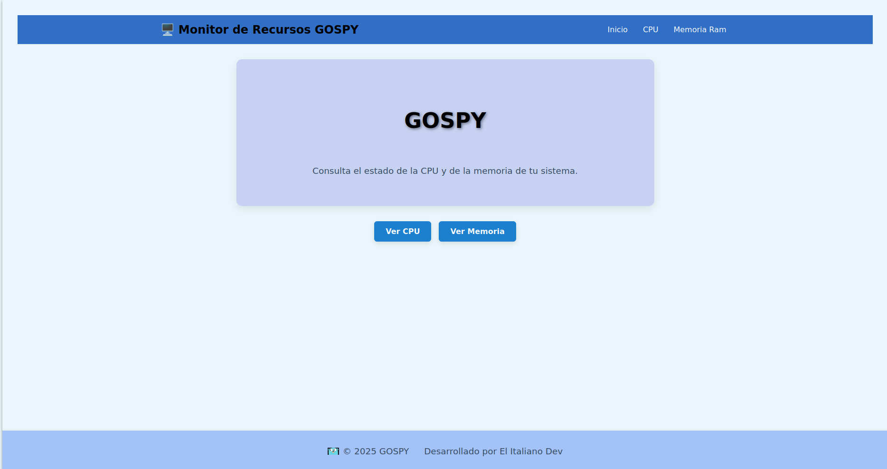
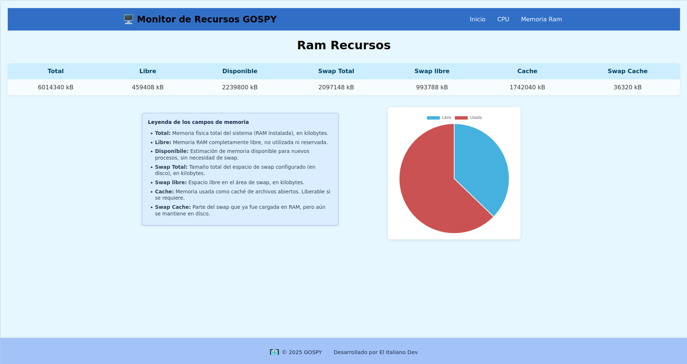
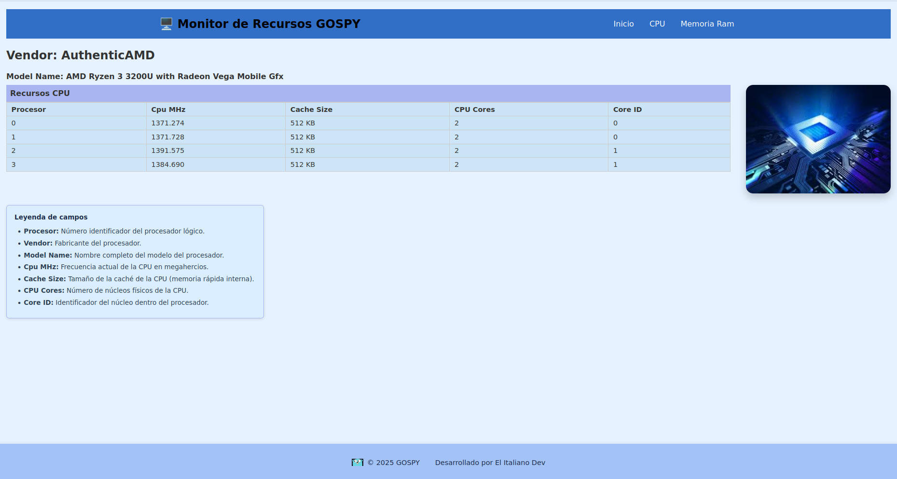

# GOSPY

**Herramienta que monitoriza la CPU y la memoria RAM**

### 🧠 CPU

Saca la información de:
- Modelo
- Fabricante
- ID del procesador
- MHz a los que trabaja
- Tamaño de la caché
- Número de núcleos físicos de la CPU
- ID del núcleo físico que aloja el procesador lógico

### 💾 RAM

Saca la información de:
- Total  
- Memoria completamente libre (no reservada, no usada)  
- Memoria disponible restante  
- Memoria swap total  
- Memoria swap libre  
- Caché  
- Parte de la swap que se está usando  

# 🛠️ Tecnologías

###  Go
- Servidor HTTPS
- github.com/gravityblast/fresh@latest (cambios en tiempo real)
- Plantillas HTML

### JavaScript
- Chart para gráficas

### HTML y CSS
- Para la web

### 💡 Notas

    Este proyecto fue creado como herramienta educativa y de práctica. Está pensado para correr en entornos Linux, ya que utiliza /proc/.

# Home

# Ram

# CPU

